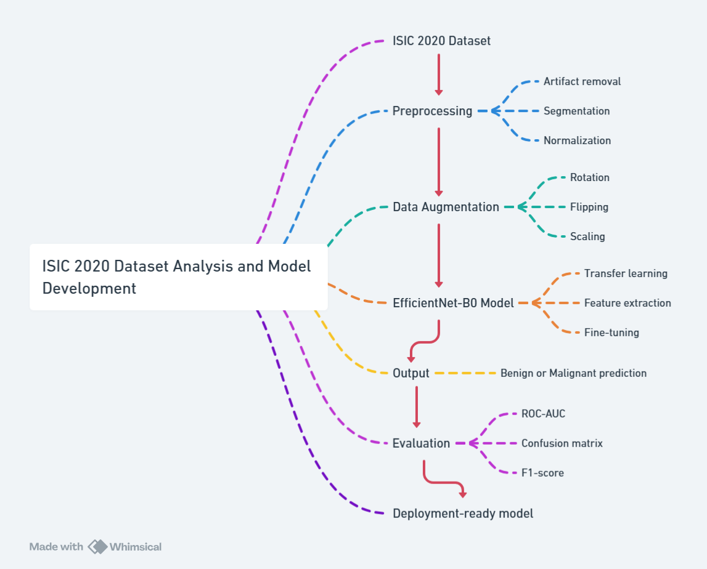

# MelaSight-Skin-Lesion-Classifier
AI-powered binary classifier for malignant vs benign skin lesions using ISIC 2020 dataset and EfficientNet

# MelaSight — AI-Powered Skin Lesion Classification

## 🚀 Overview
MelaSight is an in-progress AI project focused on classifying skin lesions as benign or malignant, supporting early diagnosis and assisting healthcare workflows. It uses the ISIC 2020 Challenge dataset and leverages transfer learning with EfficientNet.

## 💻 Tech Stack
- Python
- TensorFlow, Keras
- OpenCV
- Scikit-Learn
- EfficientNet-B0 (pre-trained)

## ⚙️ Planned Features
- Advanced image preprocessing (artifact removal, segmentation)
- Data augmentation to improve robustness
- Transfer learning with EfficientNet-B0 for high accuracy
- Evaluation metrics: ROC-AUC, confusion matrix, F1-score
- Deployment-ready modular code

## 🗺️ Architecture

## ✅ Current Status
Project setup in progress. Model pipeline design and preprocessing workflows being implemented.  
Code and experiments will be pushed progressively.

## 🗂️ Dataset
- ISIC 2020 Challenge Dataset: [ISIC Archive](https://challenge.isic-archive.com/data/)

## ✍️ Author
Harsh Pratyush Sinha

## 📄 License
MIT License 
